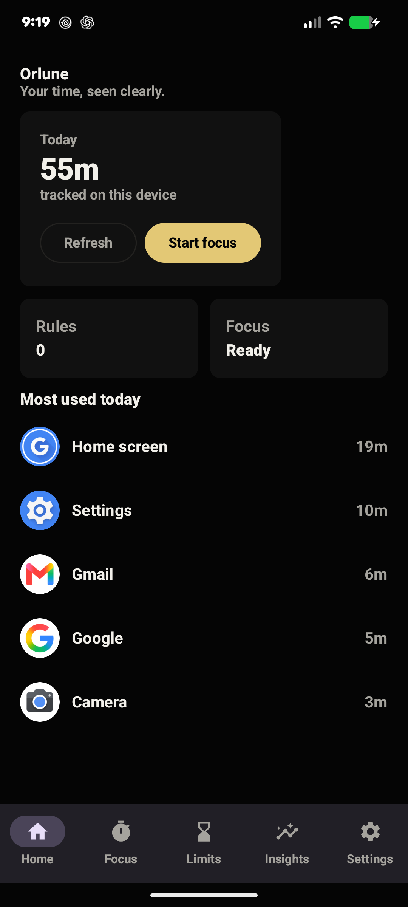
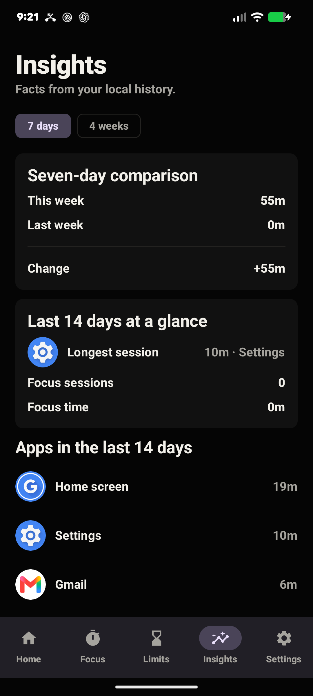
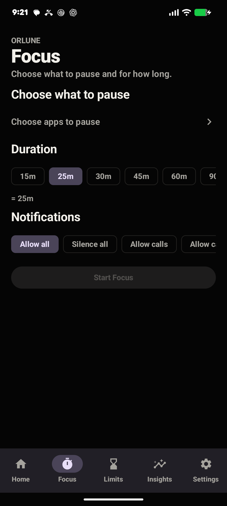
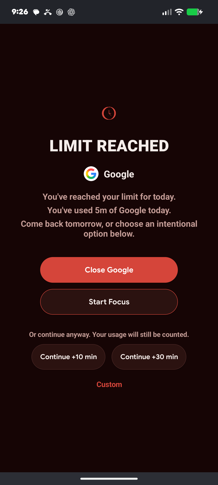
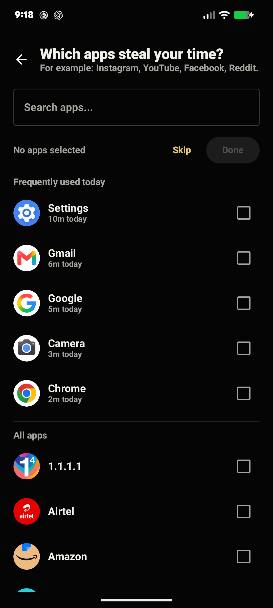
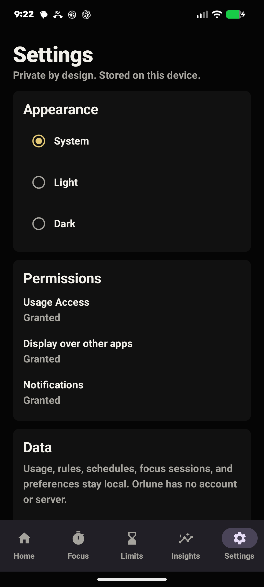
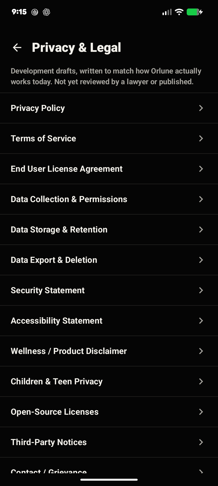
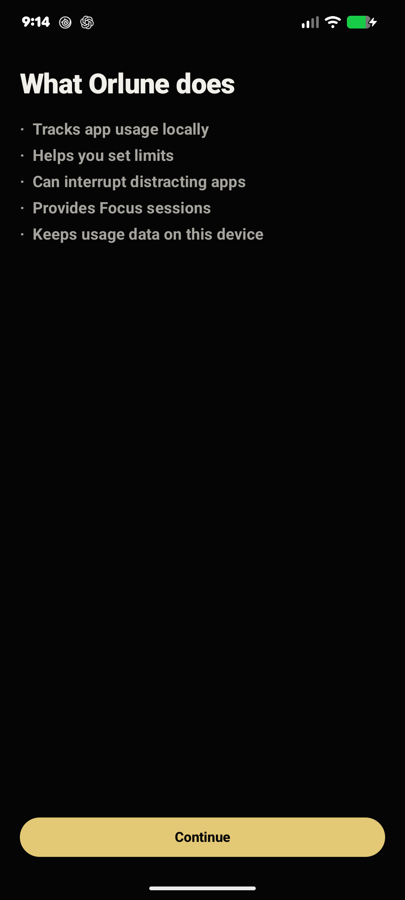

# ORLUNE

An Android digital wellbeing app designed to help you use your time intentionally.

## Overview

Orlune is a local-first Android app for reducing distracting app usage, building
focus habits, and understanding your own screen time. Everything happens on your
device: usage is read from Android's own Usage Access API, every rule is evaluated
by a deterministic engine, and every byte of data stays in a local database that
never leaves the phone.

- **Android-only** — no iOS, no web, no desktop
- **Local-first** — all processing happens on-device
- **Privacy-focused** — no account, no cloud, no ads, no AI, no behavioral analytics
- **Deterministic** — every rule/engine produces the same output for the same
  input, always; nothing is a statistical or machine-learned guess

Orlune is not a medical device and makes no medical or clinical claims. It is a
screen-time and focus tool, nothing more.

## Key Features

- App usage tracking
- Daily app limits
- Custom limits
- Scheduled restrictions
- Focus sessions
- Quiet Mode (per-session notification policy)
- App blocking / interruption
- Weekly insights
- Four-week insights
- Local data export / delete
- Privacy & Legal Center
- Light / Dark / System theme modes
- First-launch onboarding

## Screenshots

Captured on a physical Pixel 7a running the 1.0.0 build.

| Home | Insights | Focus |
|---|---|---|
|  |  |  |

| Block screen | App picker | Settings |
|---|---|---|
|  |  |  |

| Privacy & Legal | Onboarding |
|---|---|
|  |  |

## Download

### Latest Release

**Orlune v1.0.0**
Status: Portfolio / Beta

[Download the latest release on GitHub](../../releases/latest)

## Releases

| Version | Date | Status | Download |
|---|---|---|---|
| 1.0.0 | 2026-08-19 | Portfolio/Beta | [GitHub Release](../../releases/tag/v1.0.0) |

## Privacy

- Usage data is read, processed, and stored entirely on your device
- No backend — Orlune does not request Android's `INTERNET` permission
- No analytics, ads, or tracking SDKs of any kind
- No account or sign-in of any kind
- Data can be exported or deleted locally at any time from Settings

Full privacy documentation is reachable offline in-app (Settings → Privacy &
Legal Center) and tracked in this repository:

- [`docs/legal-compliance-matrix.md`](docs/legal-compliance-matrix.md)
- [`docs/google-play-privacy-compliance.md`](docs/google-play-privacy-compliance.md)

These in-app documents are development drafts pending legal review — see those
files for exactly what's still open.

## Technology

- Kotlin
- Jetpack Compose
- Room
- `UsageStatsManager`
- Coroutines / Flow
- WorkManager

See [`ARCHITECTURE.md`](ARCHITECTURE.md) for the full as-built package layout and
toolchain versions.

## Project Status

Current status: **1.0.0 portfolio/beta build.**

This is not a Google Play production release. Play Store publishing is currently
paused; this repository and its GitHub Releases are the primary distribution
channel for now. See [`docs/PROJECT_STATE.md`](docs/PROJECT_STATE.md) for the
full, dated build/test status.

## Roadmap

**Completed**
- Local usage monitoring, deterministic rule engine, app blocking
- Focus sessions with per-session Quiet Mode
- Weekly and four-week Insights
- First-launch onboarding (11 screens)
- Privacy & Legal Center (15 documents, in-app, offline)
- Local export / delete-all-data controls
- Light / Dark / System theming

**In progress**
- Security and performance hardening pass
- Broader automated test coverage

**Future**
- Legal review of Privacy Policy / Terms of Service
- Recurring focus-session scheduling
- Google Play submission (paused for now)

Feature scope is deliberately conservative — see
[`AGENTS.MD`](AGENTS.MD)'s "Forbidden" section for constraints this project holds
permanently (no accounts, no AI, no ads, no analytics, no network access).

## License

See [`LICENSE`](LICENSE). This repository is public for portfolio purposes; no
open-source license is currently granted.

## Developer

Built independently as the Orlune project.
